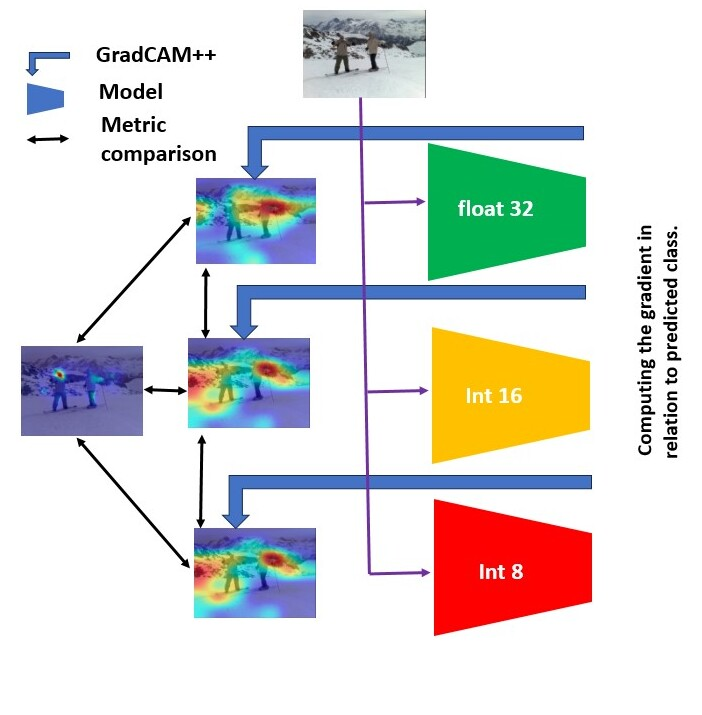
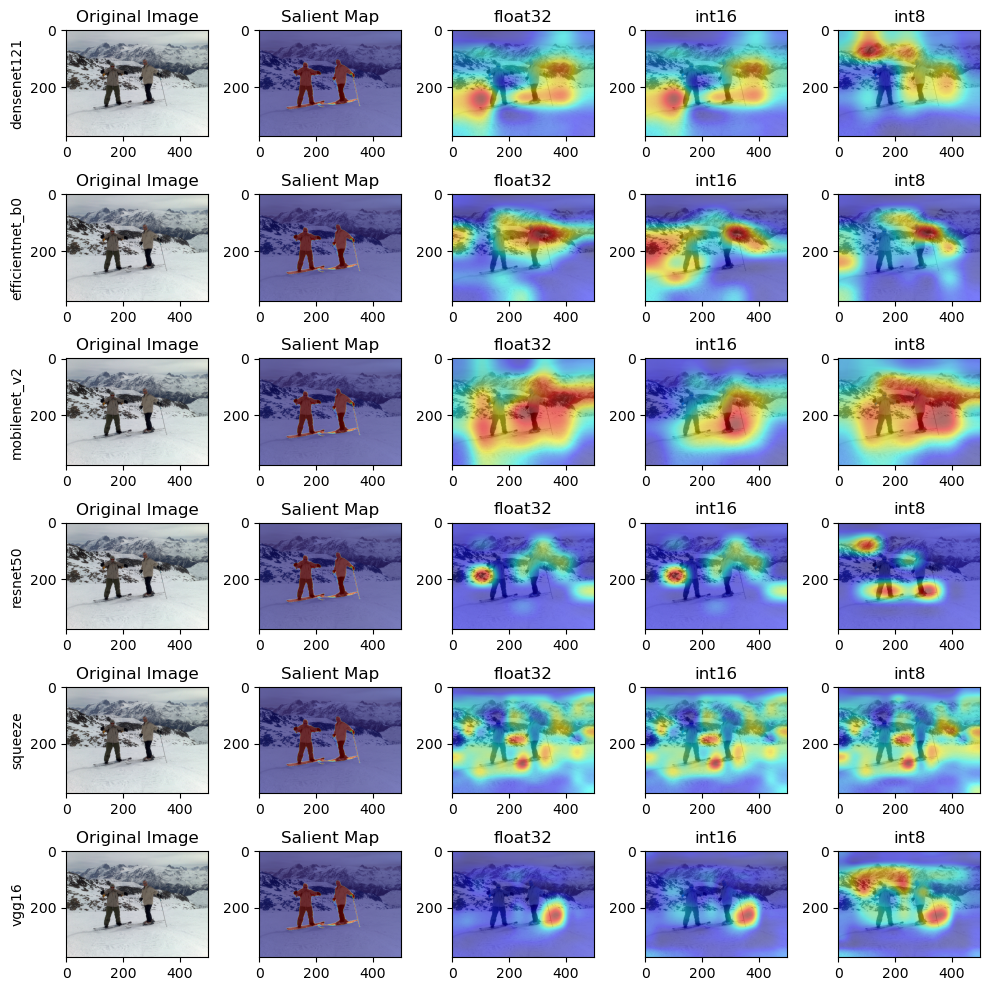
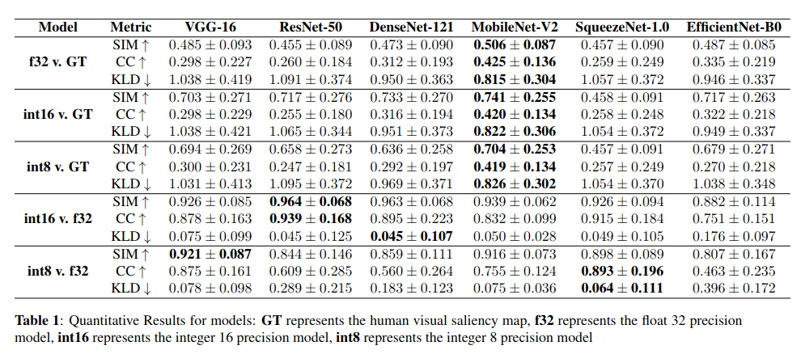
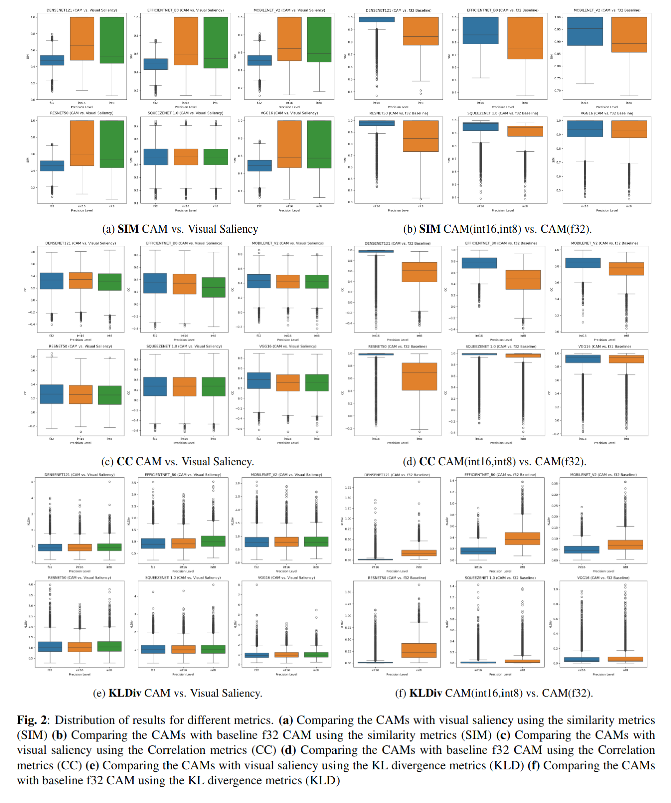

# QuantCAM

**Quantization Effects on Neural Networks Perception: How Would Quantization Change the Perceptual Field of Vision Models?**

Mohamed Amine Kerkouri, Marouane Tliba, Aladine Chetouani (Laboratoire PRISME, Université d'Orléans) and Alessandro Bruno (IULM University, Milan) — *IPTA 2024*.

[](https://www.python.org/)
[](https://pytorch.org/)
[](LICENSE)

---

## Abstract

Neural network quantization is a critical technique for deploying models on
resource-limited devices. Despite its widespread use, the impact of
quantization on model perceptual fields — particularly in relation to class
activation maps (CAMs) — remains underexplored. This study investigates how
quantization influences the spatial recognition abilities of vision models by
examining the alignment between CAMs and visual salient-object maps across
various architectures. Using 10,000 images from ImageNet, we evaluate six
diverse CNN architectures — **VGG16, ResNet50, EfficientNet, MobileNet,
SqueezeNet, and DenseNet** — and, through the systematic application of
quantization, identify subtle changes in CAMs and their alignment with
saliency. The results demonstrate the differing sensitivities of these
architectures to quantization and highlight its implications for model
performance and interpretability in real-world applications.

The full paper is included in this repository: [`QuantCAM___IPTA_2024.pdf`](QuantCAM___IPTA_2024.pdf).

## Method overview

<p align="center">
  
</p>
<p align="center">
  <em>Each model is fake-quantized to fp32, int16, and int8; GradCAM++ is applied
  to every variant and the resulting CAMs are compared to one another and to
  visual saliency.</em>
</p>

For every model and every precision, the pipeline produces a GradCAM++ heatmap
per input image:

1. **Load** a pretrained CNN in train mode.
2. **Quantize** it to each target precision. Quantization uses quantization-aware
   training *preparation* (`prepare_qat`), which inserts fake-quant/observer
   modules so the forward pass simulates int8 / int16 arithmetic while staying
   differentiable — a requirement for the gradient-based GradCAM++ method.
   - `fp32` — original full-precision model (baseline)
   - `int16` — custom fake-quant observers
   - `int8` — PyTorch default fake-quant
3. **Explain** each image with GradCAM++ at the architecture's final
   convolutional stage.
4. **Save** the resulting heatmap as a grayscale PNG for downstream comparison
   against saliency maps.

## Repository layout

```
quantcam/
├── __init__.py        # public API
├── models.py          # model registry + CAM target-layer selection
├── quantization.py    # int8 / int16 fake-quant QConfigs, quantize_model()
├── cam.py             # GradCAM++ heatmap generation
├── data.py            # image discovery, loading, preprocessing
├── visualize.py       # heatmap resize / colorize / overlay / save
├── cli.py             # argparse entry point and main loop
└── __main__.py        # `python -m quantcam`
run.py                 # convenience wrapper
requirements.txt
```

## Installation

```bash
git clone <repo-url>
cd CAM_Quant

python -m venv .venv && source .venv/bin/activate   # optional
pip install -r requirements.txt
```

A CUDA-capable GPU is used automatically when available; otherwise the pipeline
runs on CPU (slower).

## Dataset

The experiments use the **ImageNet (ILSVRC 2012) validation split**, which is
not distributed with this repository. Download it from
[image-net.org](https://image-net.org/) and point `--data-dir` at the folder of
images. The default expected location is:

```
./ILSVRC/Data/CLS-LOC/val
```

The first 10,000 images (sorted) are used by default, matching the paper.

## Usage

Run the full study (all six models × fp32/int16/int8 over 10,000 images):

```bash
python run.py
# equivalently: python -m quantcam
```

Common options:

```bash
# A quick smoke test on a subset
python run.py --models resnet50 --precisions fp32 int8 --limit 20

# Custom paths and device
python run.py --data-dir /path/to/images --output-dir ./out --device cuda

# See all options
python run.py --help
```

| Option | Default | Description |
| --- | --- | --- |
| `--data-dir` | `./ILSVRC/Data/CLS-LOC/val` | Directory of input images |
| `--output-dir` | `./results_heatmaps` | Where heatmaps are written |
| `--models` | all | Subset of `vgg16 resnet50 densenet121 mobilenet_v2 efficientnet_b0 squeezenet1_1` |
| `--precisions` | `fp32 int16 int8` | Precisions to evaluate |
| `--limit` | `10000` | Max images (`0` = no limit) |
| `--image-size` | `224` | Square input resolution |
| `--device` | `auto` | `auto`, `cpu`, or `cuda` |
| `--log-file` | timestamped | Log file path |

## Output

Heatmaps are written as grayscale PNGs, organized by model and precision:

```
results_heatmaps/
└── <model_name>/
    └── <precision>/          # fp32 | int16 | int8
        └── <image_name>.png
```

Each run also writes a timestamped `quantcam_<timestamp>.log` recording
progress and any per-image failures.

## Results

### Qualitative

<p align="center">
  
</p>
<p align="center">
  <em>Qualitative comparison on an ImageNet validation image. Each row is an
  architecture; columns show the original image, the human visual-saliency map,
  and the GradCAM++ heatmaps at fp32, int16, and int8 precision.</em>
</p>

### Quantitative

<p align="center">
  
</p>
<p align="center">
  <em>Table 1 — Quantitative results. GT is the human visual-saliency map;
  f32 / int16 / int8 are the precision levels. SIM and CC: higher is better (&uarr;);
  KLD: lower is better (&darr;).</em>
</p>

<p align="center">
  
</p>
<p align="center">
  <em>Fig. 2 — Distribution of SIM, CC, and KLD over the 10,000-image set,
  comparing CAMs against visual saliency (left column of each metric) and
  against the fp32 baseline (right column).</em>
</p>

## Citation

If you use this code, please cite the paper:

```bibtex
@inproceedings{kerkouri2024quantcam,
  title     = {Quantization Effects on Neural Networks Perception: How Would
               Quantization Change the Perceptual Field of Vision Models?},
  author    = {Kerkouri, Mohamed Amine and Tliba, Marouane and
               Chetouani, Aladine and Bruno, Alessandro},
  booktitle = {International Conference on Image Processing Theory,
               Tools and Applications (IPTA)},
  year      = {2024},
}
```

## License

Released under the [MIT License](LICENSE).
